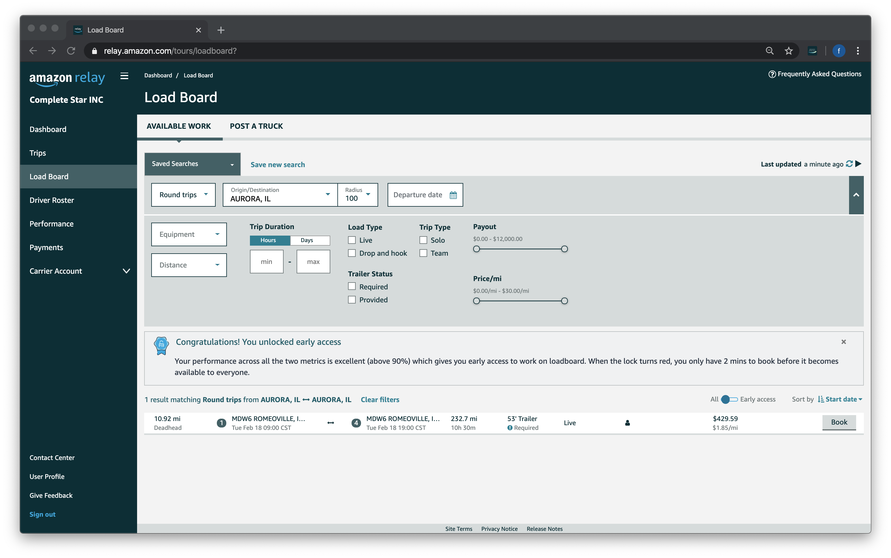
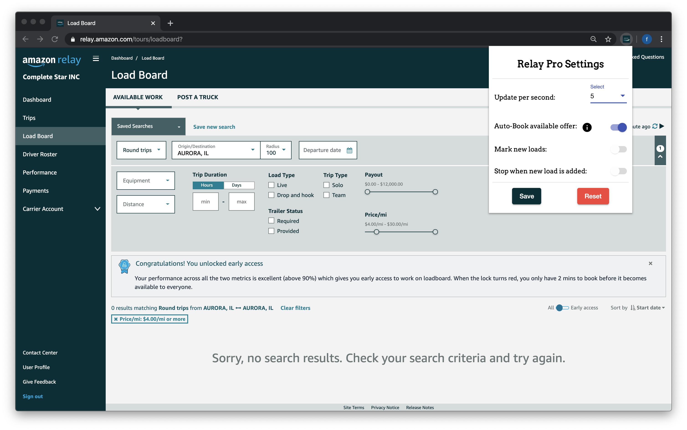
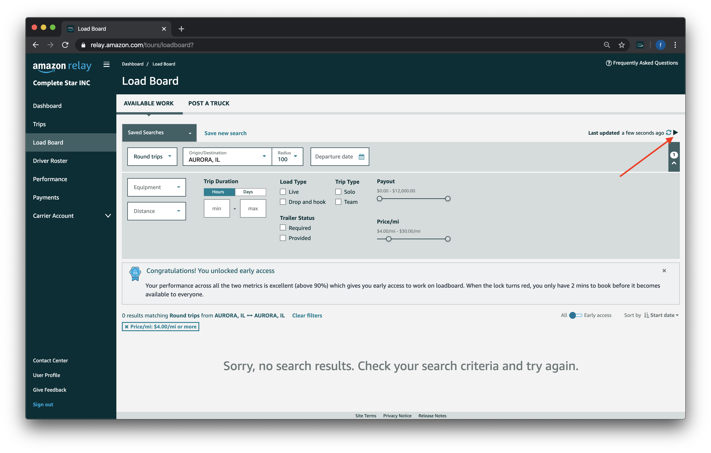
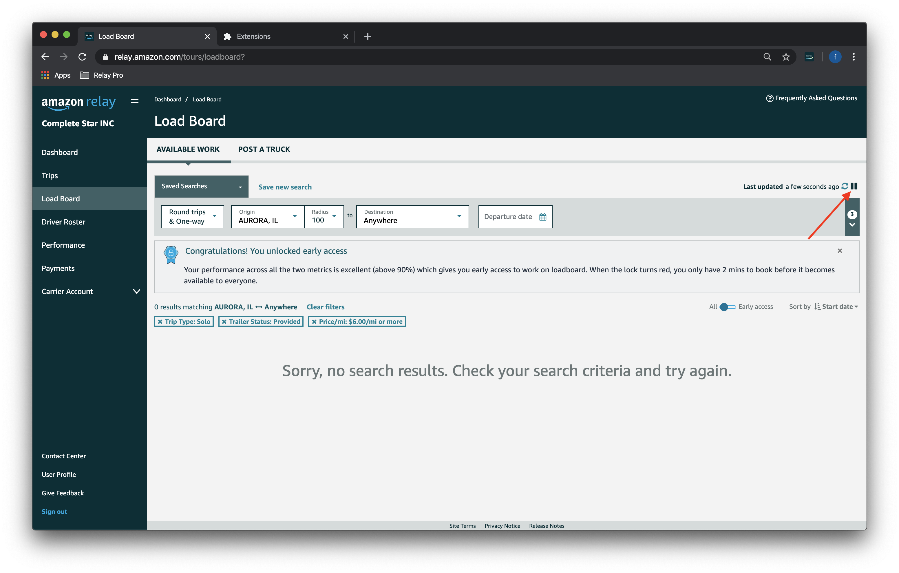

# About the extension
> Amazon Relay Pro Extension 

Amazon Relay Pro is productivity hack for people who wants to automate mundane daily tasks of refreshing the browser and waiting for the loads to appear. Using easly configurable features you can tell the extension to do the job for you. Get an edge over your competition.
It offers the following features:
* Blazing fast Auto Refresh 🚀
* Auto Book the loads 💪 (Game changer)
* Auto Stop when new load appears on the board ⛔️
* Highlight the new load so it can be easily identified 📌
* Get pleasant sound notifications 🔔

[Get the Extension](https://chrome.google.com/webstore/detail/amazon-relay-pro/peionlgkagofbcdmkjmnjfbpnfchdkal?hl=en&gl=US&authuser=0)

# Requirements
> Current requirements

1. Works only in Chrome (Firefox is coming soon... 👨‍💻)
2. Designed for Amazon Relay 
3. User should have Amazon Relay account
4. User should have a google account

# How to install
> Instructions on how to install

1. Go to the [Chrome Webstore product page](https://chrome.google.com/webstore/detail/amazon-relay-pro/peionlgkagofbcdmkjmnjfbpnfchdkal?hl=en&gl=US&authuser=0)
2. Click Buy button 
3. Complete the payment process ✍🏼
4. Get the extension installed to your browser

# How to use
1. Go to the [Amazon Relay Loadboard](https://relay.amazon.com/tours/loadboard?)
2. Apply desired filters:

3. Open configuration pop up by clicking the extension logo:

4. Apply the speed you want to refresh:

5. Auto Book when new load appears (Make sure board is clean when this toggle is on):

6. Alternativly configuration may be set to stop when new load is added and highlight the new load:

7. Click play button:

8. It will start refreshing based on the config you set! 🎉 🎉 🎉
9. To stop the refresher, just click the pause button highlighted below. Also, Command Key on Mac OS or Windows Key on Windows OS can be used to stop the refresher:

# See it in action
> See the extension in action
<iframe width="560" height="400" src="https://www.youtube.com/embed/7GH82wDVe5U" frameborder="0" allow="accelerometer; autoplay; encrypted-media; gyroscope; picture-in-picture" allowfullscreen></iframe>

# Reported issues
> Known bugs

There are no bugs reported at this moment. Please report possible bugs to below contact info.

# Contact
> Contact information:

 📨 faraday.techno@gmail.com
 
 📰  https://t.me/joinchat/AAAAAFHP0SAXEH6ViWDinw
