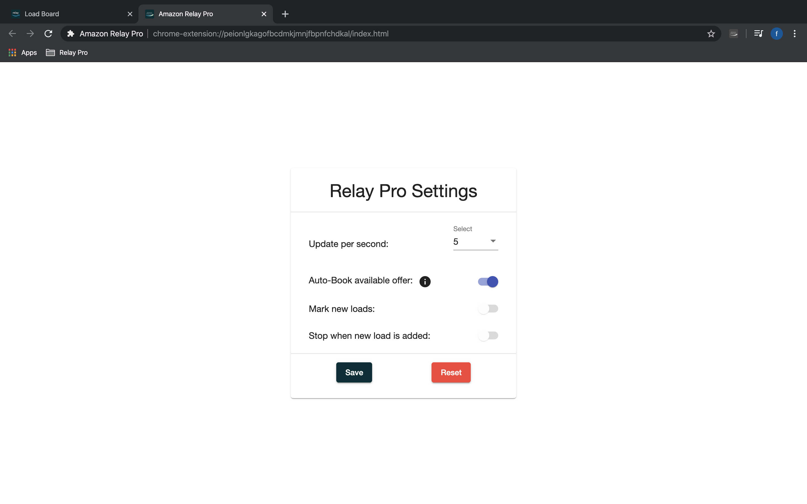

# About the extension
> Amazon Relay Pro Extension 

Amazon Relay Pro is productivity hack for people who wants to automate mundane daily tasks of refreshing the browser and waiting for the loads to appear. Using easly configurable features you can tell the extension to do the job for you. Get an edge over the competition and automate your daily work.
It offers following features:

* **Auto Book loads** 💪 (Game changer)
* Blazing fast Auto Refresh 🚀
* Auto Stop when new load appears on the board ⛔️
* Highlight the new load so it can be easily identified 📌
* Get pleasant sound notifications 🔔

[Get the Extension](https://chrome.google.com/webstore/detail/amazon-relay-pro/peionlgkagofbcdmkjmnjfbpnfchdkal?hl=en&gl=US&authuser=0)

# Requirements
> Current requirements

1. Works only in Chrome (Firefox is coming soon... 👨‍💻)
2. Designed for Amazon Relay 
3. User should have a Amazon Relay account
4. User should have a google account

# How to install
> Instructions on how to install

1. Go to the [Chrome Webstore product page](https://chrome.google.com/webstore/detail/amazon-relay-pro/peionlgkagofbcdmkjmnjfbpnfchdkal?hl=en&gl=US&authuser=0)
2. Click Buy button 
3. Complete the payment process ✍🏼
4. Get the extension installed on your browser

# How to use
1. Go to the [Amazon Relay Loadboard](https://relay.amazon.com/tours/loadboard?)
2. Apply desired filters:

3. Open configuration pop up by clicking the extension logo:

4. Apply the speed you want to refresh:

5. Toggle the "Auto-Book available offer" option, (Make sure board is clean when this toggle is on) save the configuration and click the play button:

6. It will start refreshing and notifies you when it books the load that matches the filter! 🎉 🎉 🎉

> Alternatively, you can configure the settings to stop when new load appears. To do that, repeat the steps 2..4 then
 
5. Toggle the "Stop when new load is added" option and possibly toggle "Mark new loads":

6. Click play button:

7. It will start refreshing and notify you when new load is added! 🎉 🎉 🎉

9. To stop the refresher, just click the pause button highlighted below. Also, Command Key on Mac OS or Windows Key on Windows OS can be used to stop the refresher:

# See it in action
> See the extension in action
<iframe width="560" height="400" src="https://www.youtube.com/embed/7GH82wDVe5U" frameborder="0" allow="accelerometer; autoplay; encrypted-media; gyroscope; picture-in-picture" allowfullscreen></iframe>

# Reported issues
> Known bugs

There are no bugs reported at this moment. Please report possible bugs and feedback to the below contact info. 

# Contact
> Contact information:

 📨 faraday.techno@gmail.com

 📰  https://t.me/joinchat/AAAAAFHP0SAXEH6ViWDinw
