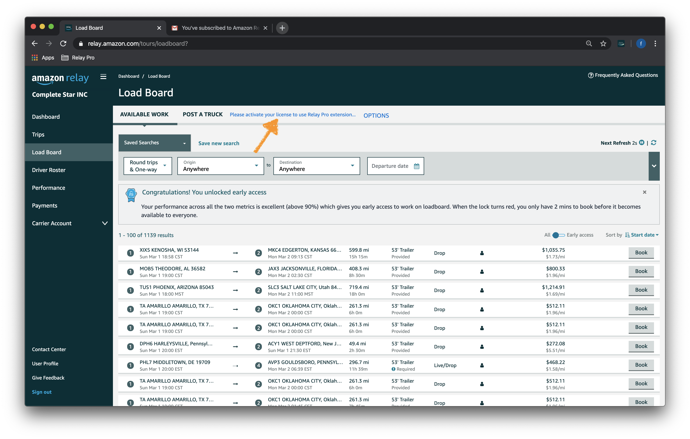
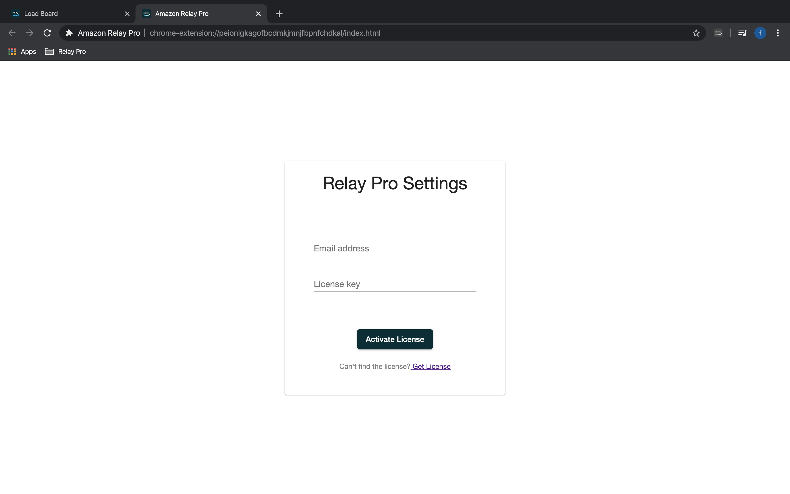
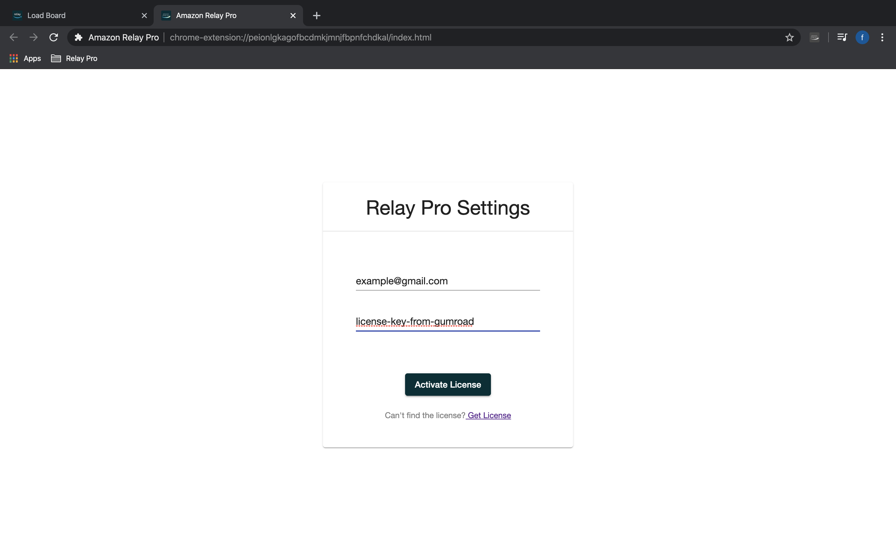
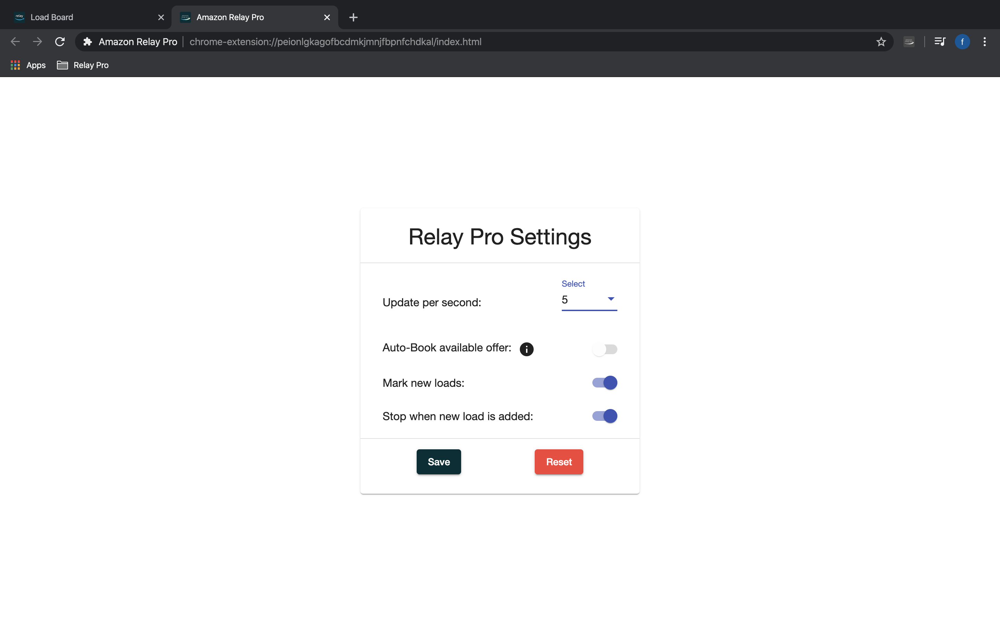
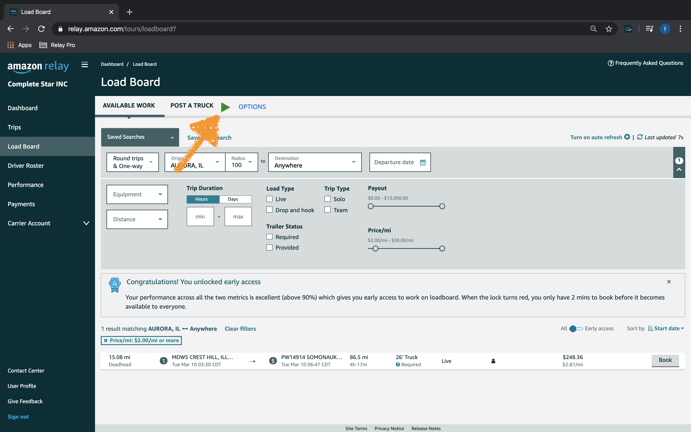
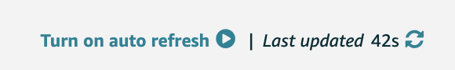
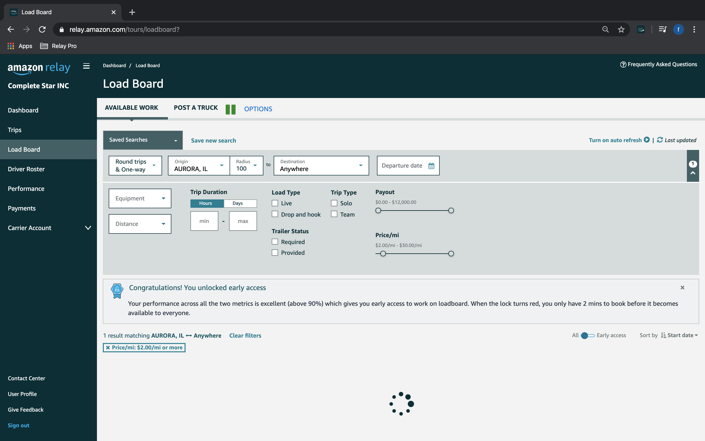
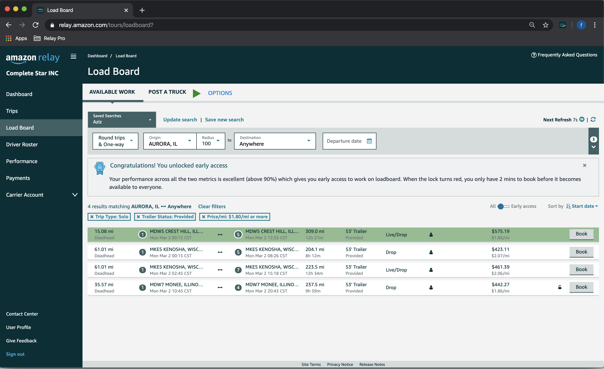

# How to use
1. Go to the [Amazon Relay Loadboard](https://relay.amazon.com/tours/loadboard?)
2. You will see warning for license activation.

3. Click OPTIONS link right next to warning, it will open new tab with license activation form.

4. Enter your gumroad 'email' and 'license key' and click activate.

5. You should see settings page show up, where you can configure.

6. After filling out desired settings, click save and settings will be saved. You should see play button in the Dashboard page tab. You may repeat that time by time to make sure license is up to date.

7. Set desired filters and click Play. Make sure built in refresh is off: 

8. Once it finds match for your filter, refresher will stop and notifies by sound notification. For sound notification to work please update your browser settings by open **Settings > Privacy and Security > Site Settings > Sound** in your browser or just open **chrome://settings/content/sound** in a new tab, then turn on **Allow sites to play sound**. 

9. Alternatively, you can configure it to use auto book as a setting by toggling "Auto-Book available offer" toggle (Make sure board is clean when this toggle is on) in settings page then click save. Repeat the process.

10. It will notify you when load is booked! 🎉 🎉 🎉

# Keyboard shortcuts
> Key bindings

Use <kbd>`</kbd> key to start/stop the refresher.

# See it in action
> See the extension in action

<iframe width="560" height="315" src="https://www.youtube.com/embed/n7EFgAfNGN8" frameborder="0" allow="accelerometer; autoplay; encrypted-media; gyroscope; picture-in-picture" allowfullscreen></iframe>

# See Auto-Book in action
> See Auto-Book in action

<iframe width="560" height="315" src="https://www.youtube.com/embed/SGw9Uqr9_Yk" frameborder="0" allow="accelerometer; autoplay; encrypted-media; gyroscope; picture-in-picture" allowfullscreen></iframe>
